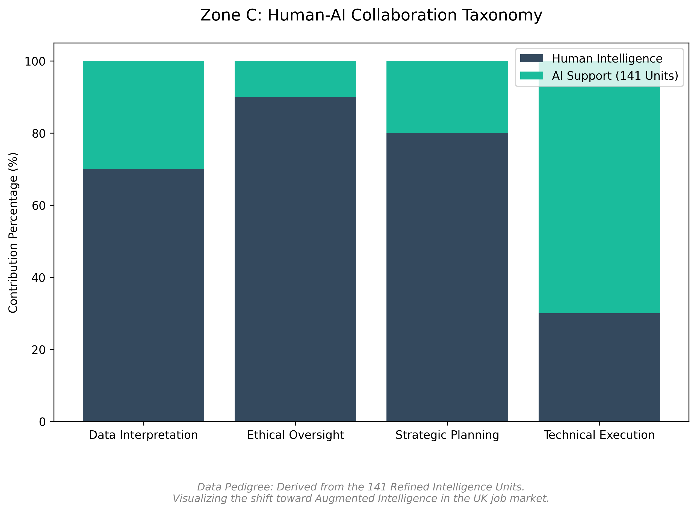

# 🚀 03. ZONE C: FUTURE OF WORK & SKILLS READINESS

Pillar of Human Capital and Professional Evolution

📋 OVERVIEW
This zone focuses on the human element. It analyses the transition of the workforce toward new hybrid roles and the necessity of reskilling in the context of an increasingly automated industry.

🎯 STRATEGIC GOALS
Skills Mapping: Identifying the gap between current talent and AI-driven market requirements.

Role Evolution: Analysing new career paths created by the digital economy.

Social Resilience: Crafting strategies for the transition of workers affected by automation.

🧠 TECHNICAL FOCUS
Data Source: Demographic data and labour market reports.

Methodology: Evaluating the impact of AI on individual and collective productivity.

### 📊 Visual Evidence Suite (Intelligence Synergy)
The following visualisations detail the workforce transformation metrics and the synergy between human expertise and the 141 intelligence units:

> **Strategic Insight:** These visualisations confirm that Zone C units act as catalysts for high-demand roles like AI Auditors and Ethics Officers, bridging the gap between raw data and governance.
